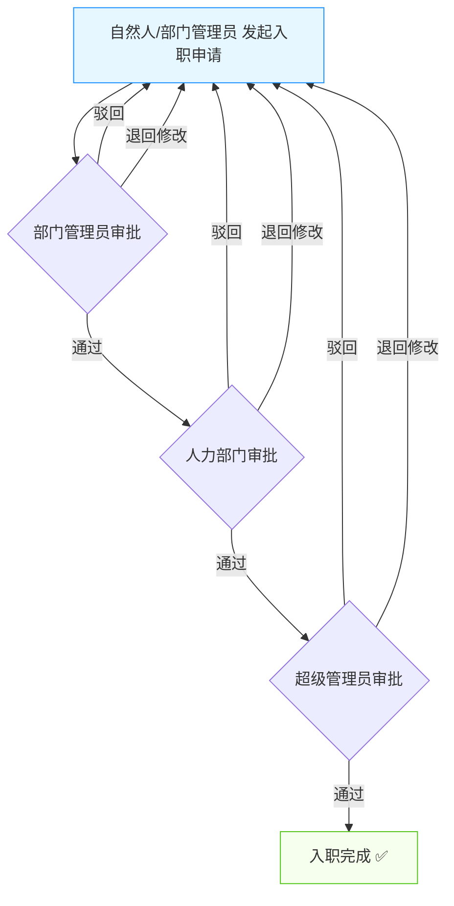
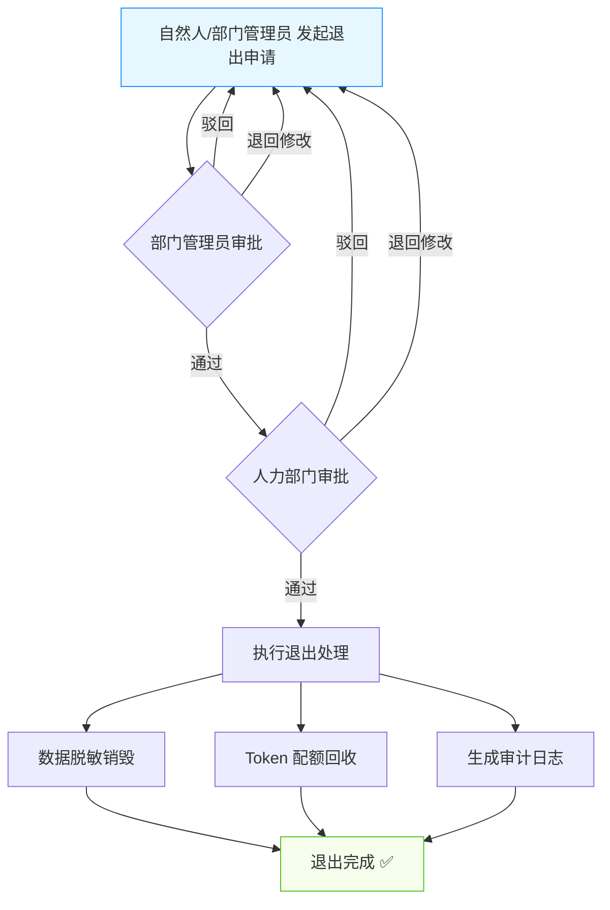
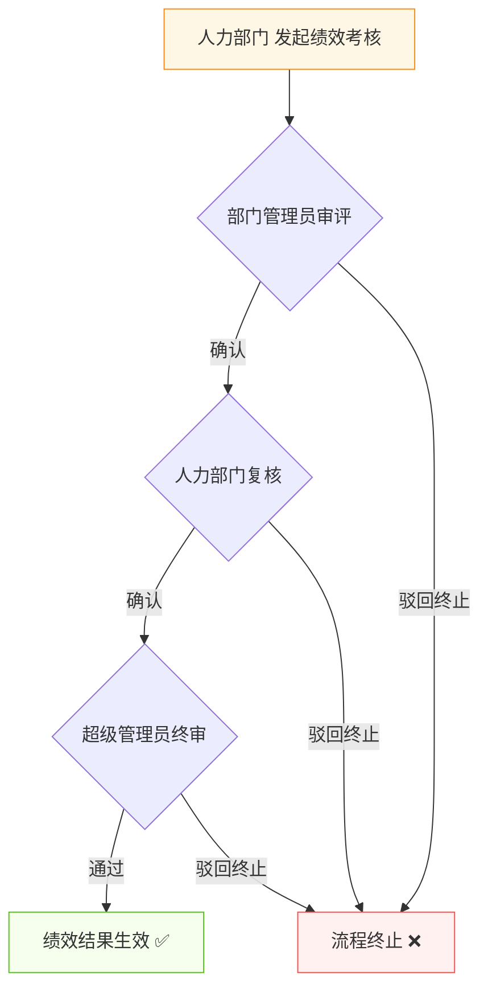
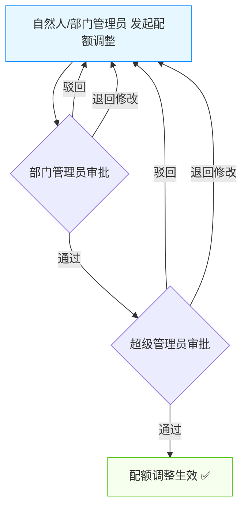

# AI 数字员工管理平台 — 需求文档

> 文档版本：v2.1  
> 更新日期：2026-03-23  
> 项目状态：前端原型开发完成（模拟数据）

---

## 一、项目背景

公司结合已有的智能体、技能、知识库资源，根据员工实际工作需求，打造一批 **AI 数字员工**，旨在快速处理公司内部各类工作任务、提升运营效率、降低人力成本。

本平台分为 **用户端** 和 **后台管理端** 两大模块：
- **用户端**：集成在现有的天翼云数字人平台中，为员工提供与 AI 数字员工交互协作的入口，包括聊天对话、智能体中心、数字员工通讯录、定时任务等功能。
- **后台管理端**：为管理员提供数字员工全生命周期管理、运营监控、效益分析、角色权限管理等能力。

---

## 二、系统架构

### 2.1 技术栈

| 层级 | 技术选型 |
|------|---------|
| 前端框架 | React 19 + TypeScript |
| 构建工具 | Vite 7 |
| UI 组件库 | Ant Design 6 |
| 路由 | React Router 7 |
| 图表 | Recharts 3 |
| 数据 | 前端模拟数据（Mock） |

### 2.2 模块划分

```
├── 用户端 (/user)
│   ├── 个人助手（聊天对话主页面）
│   ├── 智能体中心（更多智能体）
│   ├── 数字员工通讯录（组织架构视图）
│   ├── 定时任务管理
│   ├── 员工通讯录弹窗
│   ├── 人岗匹配（预留）
│   ├── 营销智能体（预留）
│   ├── 翼达-商机挖掘（预留）
│   ├── 知识中心（预留）
│   └── 知识运营（预留）
│
└── 管理后台 (/admin)
    ├── 运营驾驶舱（全局数据概览 + 预警与待办）
    ├── 全生命周期管理（入职 / 在岗 / 考核 / 退出）
    ├── 审批流管理
    ├── 技能配置
    ├── 知识配置
    ├── Tokens 与效益
    └── 角色与权限配置
```

---

## 三、角色与权限体系

### 3.1 角色定义

本平台定义五种系统角色，各角色拥有不同的功能权限和数据可见范围：

| 角色 | 角色编码 | 描述 |
|------|---------|------|
| 超级管理员 | SUPER_ADMIN | 平台最高权限，可管理所有数字员工、配置全局参数、审批所有流程 |
| 部门管理员 | DEPT_ADMIN | 管理本部门数字员工的日常运营、审批本部门相关申请 |
| 自然人 | OWNER | 数字员工的直接管理人，管理自己创建/负责的数字员工 |
| 人力部门 | HR | 负责数字员工入离职审批、绩效考核、人事数据管理 |
| 审计 | AUDITOR | 对平台操作进行合规审计、查看审计日志和报表（只读） |

### 3.2 功能权限矩阵

| 功能模块 | 超级管理员 | 部门管理员 | 自然人 | 人力部门 | 审计 |
|---------|:---------:|:---------:|:-----:|:-------:|:---:|
| 运营驾驶舱 | ✅ 全部 | ✅ 本部门数据 | ❌ | ✅ 人事维度 | ✅ 只读 |
| 入职管理 | ✅ 审批 | ✅ 发起/审批 | ✅ 发起 | ✅ 审批 | ✅ 只读 |
| 在岗管理 | ✅ 全部 | ✅ 本部门 | ✅ 自己的 | ✅ 查看 | ✅ 只读 |
| 考核管理 | ✅ 全部 | ✅ 本部门 | ✅ 查看自己的 | ✅ 发起/管理 | ✅ 只读 |
| 退出管理 | ✅ 审批 | ✅ 发起/审批 | ✅ 发起 | ✅ 审批 | ✅ 只读 |
| 技能配置 | ✅ 增删改查 | ✅ 查看/绑定 | ✅ 查看 | ❌ | ✅ 只读 |
| 知识配置 | ✅ 增删改查 | ✅ 查看/绑定 | ✅ 查看 | ❌ | ✅ 只读 |
| Tokens 与效益 | ✅ 全部 | ✅ 本部门 | ✅ 自己的 | ✅ 查看 | ✅ 只读 |
| 审批流管理 | ✅ 全部 | ✅ 本部门相关 | ✅ 自己发起的 | ✅ HR环节 | ✅ 只读 |
| 角色与权限配置 | ✅ 全部 | ❌ | ❌ | ❌ | ✅ 只读 |
| 预警中心 | ✅ 全部 | ✅ 本部门 | ✅ 自己的 | ✅ 人事相关 | ✅ 只读 |

### 3.3 数据权限范围

| 角色 | 数据可见范围 | 说明 |
|------|------------|------|
| 超级管理员 | **全公司全量数据** | 可查看和操作所有部门、所有数字员工的完整数据，包括敏感配置信息 |
| 部门管理员 | **本部门数据** | 仅可查看本部门下属数字员工的运行数据、任务数据、Token 消耗；无法查看其他部门数据 |
| 自然人 | **本人数据** | 仅可查看自己创建/管理的数字员工数据，包括运行状态、任务进度、Token 消耗 |
| 人力部门 | **全公司人事维度数据** | 可查看所有数字员工的入离职信息、绩效考核数据、人事变动记录；不可查看技能/知识配置详情 |
| 审计 | **全公司审计维度数据（只读）** | 可查看所有操作日志、审批记录、合规数据、预警处理记录；无任何写入权限 |

### 3.4 角色视角下的模拟数据差异

切换角色视角时，平台模拟数据随之变更：

| 角色 | 数字员工列表 | 驾驶舱统计 | 预警信息 | Token 数据 |
|------|-----------|-----------|---------|-----------|
| 超级管理员 | 显示全部 50+ 数字员工 | 全公司汇总指标 | 所有预警 | 全公司 Token 消耗 |
| 部门管理员 | 仅显示本部门 8-12 个数字员工 | 本部门汇总指标 | 本部门预警 | 本部门 Token 消耗 |
| 自然人 | 仅显示自己管理的 2-5 个数字员工 | 个人管理维度指标 | 自己数字员工的预警 | 自己数字员工的 Token 消耗 |
| 人力部门 | 显示全部（人事视角） | 人力资源维度指标 | 入离职/绩效相关预警 | 不显示 |
| 审计 | 显示全部（只读） | 合规与审计维度指标 | 合规类预警 | 全公司 Token 消耗（只读） |

---

## 四、用户端需求

### 4.1 集成入口

- 在现有天翼云数字人平台左侧导航栏中，集成完整的用户端功能入口
- 保持与现有平台一致的视觉风格（白色侧边栏、红色品牌色）

### 4.2 用户端导航结构

用户端采用左侧导航栏 + 顶部操作栏的布局：

| 导航项 | 图标 | 路由 | 状态 |
|-------|------|------|------|
| 个人助手 | UserOutlined | `/user/chat` | ✅ 已实现 |
| 人岗匹配 | TeamOutlined | `/user/match` | 🔜 预留 |
| 营销智能体 | BulbOutlined | `/user/marketing` | 🔜 预留 |
| 翼达（商机挖掘） | AimOutlined | `/user/opportunity` | 🔜 预留 |
| 更多智能体 | AppstoreOutlined | `/user/agents` | ✅ 已实现 |
| --- 分隔线 --- | | | |
| 知识中心 | BookOutlined | `/user/knowledge` | 🔜 预留 |
| AI 数字员工 | RobotOutlined | `/user/digital-employees` | ✅ 已实现 |
| 知识运营 > 运营概览 | FundProjectionScreenOutlined | `/user/knowledge-ops/overview` | 🔜 预留 |
| 知识运营 > 内容管理 | | `/user/knowledge-ops/content` | 🔜 预留 |
| 最近对话 | HistoryOutlined | `/user/recent` | 🔜 预留 |

顶部操作栏包含：
- 左侧：侧边栏折叠按钮
- 右侧：管理后台入口按钮、用户头像

### 4.3 个人助手（聊天对话主页面）

这是用户端的核心页面，采用三栏布局：左侧对话列表 + 中间聊天区域 + 右侧详情面板。

#### 4.3.1 左侧对话列表

| 功能项 | 描述 |
|-------|------|
| 对话列表 | 以列表形式展示用户与各数字员工的对话，显示头像、名称、最后消息、时间、未读数 |
| 对话搜索 | 支持按员工名称、消息内容关键词搜索 |
| 在线状态 | 各数字员工头像旁显示实时在线状态圆点 |
| 未读提示 | 未读消息显示红色数字角标 |
| 快捷入口 | 顶部提供三个快捷按钮：员工通讯录（+）、定时任务（日历）、搜索 |

#### 4.3.2 中间聊天区域

| 功能项 | 描述 |
|-------|------|
| 顶部信息栏 | 显示当前对话数字员工的头像、名称、部门、在线状态，右侧有"查看详情"按钮 |
| 欢迎语 | 首次进入对话时，数字员工自动发送自我介绍，包含名称和职责描述 |
| 快捷操作 | 首次对话时展示预设快捷指令标签：处理待办、生成周报、分析数据、查看知识更新 |
| 消息气泡 | 用户消息蓝色气泡靠右，AI 回复白色气泡靠左，支持 Markdown 加粗渲染 |
| 技能调用标签 | AI 回复下方显示本次调用的技能标签（如"客户服务"、"工单处理"） |
| 消息操作 | AI 回复支持复制、点赞、不满意反馈三个操作按钮 |
| 加载动画 | AI 回复过程中展示三点跳动打字动画 |
| 输入区域 | 底部输入框，支持文件附件上传按钮、文本输入（支持多行）、语音输入按钮、发送按钮 |
| 键盘快捷键 | Enter 发送消息，Shift+Enter 换行 |
| 自动滚动 | 新消息自动滚动到底部 |

#### 4.3.3 右侧详情面板

点击"查看详情"按钮展开/收起，宽度 320px，包含四个标签页：

| 标签页 | 内容 |
|-------|------|
| 详情 | 数字员工头像、名称、状态标签、职责描述、基本信息（工号/部门/岗位/职级/归属人/入职日期）、Tokens 使用进度条 |
| 技能 | 已绑定的技能标签列表，以及各技能的名称、等级、描述详情 |
| 知识 | 关联知识库列表，显示名称、类型图标、状态标签、描述和文档数 |
| 任务 | 该数字员工的任务列表，显示任务名称、状态标签、创建时间 |

### 4.4 员工通讯录弹窗

在聊天页面点击左上角"+"按钮打开，用于快速查找并发起与数字员工的对话。

| 功能项 | 描述 |
|-------|------|
| 弹窗尺寸 | 宽度 900px，高度 520px，标题"员工通讯录" |
| 左侧面板 | 按部门/按岗位两种视图切换，树形结构展示所有数字员工 |
| 搜索功能 | 顶部搜索框支持按员工名称、岗位关键词搜索 |
| 按部门视图 | 以"天翼云数字员工"为根节点，下挂各部门，显示各部门员工数量 |
| 按岗位视图 | 按岗位分组展示，每组显示所属部门标签和员工数量 |
| 右侧面板 | 选中部门/岗位后，展示该分组下的数字员工卡片，每张卡片含头像、名称、状态、部门岗位、"发起对话"按钮 |
| 发起对话 | 点击"发起对话"后自动将该员工添加到对话列表并切换到该对话 |

### 4.5 定时任务管理

在聊天页面点击左上角日历图标打开，用于管理数字员工的自动化定时任务。

#### 4.5.1 功能概述

定时任务允许用户为数字员工配置周期性的自动化任务，系统将按照设定的时间规则自动触发数字员工执行指定工作，无需人工干预。

#### 4.5.2 定时任务列表

| 功能项 | 描述 |
|-------|------|
| 弹窗入口 | 聊天页面左上角日历图标，标题"定时任务" |
| 任务列表 | 以列表形式展示所有已创建的定时任务 |
| 任务信息 | 每条任务显示：任务名称、执行频率标签、启用/暂停状态标签 |
| 执行详情 | 显示执行员工名称、任务描述、上次执行时间、下次执行时间 |
| 启用/暂停 | 每条任务右侧提供 Switch 开关，支持一键启用或暂停定时任务 |
| 新建按钮 | 列表上方提供"新建定时任务"按钮 |

#### 4.5.3 新建定时任务

| 字段 | 类型 | 必填 | 描述 |
|------|------|:----:|------|
| 任务名称 | 文本输入 | ✅ | 定时任务的名称，如"每日客户工单处理" |
| 执行员工 | 下拉选择 | ✅ | 选择执行该任务的数字员工（仅展示在线状态的员工） |
| 执行频率 | 下拉选择 | ✅ | 预设频率选项：每天 08:00、每天 09:00、每周一 09:00、每周五 17:00、每月1日 09:00、每月15日 09:00 |
| Cron 表达式 | 文本输入 | ❌ | 可选，支持自定义 Cron 表达式（如 `0 8 * * *`） |
| 任务描述 | 多行文本 | ❌ | 描述该定时任务的具体执行内容 |

#### 4.5.4 定时任务示例数据

| 任务名称 | 执行员工 | 执行频率 | 状态 | 描述 |
|---------|---------|---------|------|------|
| 每日客户工单处理 | 小翼·客服 | 每天 08:00 | 已启用 | 自动处理前一天未完成的客户工单 |
| 周报自动生成 | 小翼·营销 | 每周一 09:00 | 已启用 | 自动生成上周营销周报 |
| 月度报销检查 | 小翼·财务 | 每月1日 09:00 | 已启用 | 自动执行月度报销单据合规检查 |
| 数据质量巡检 | 小翼·数据 | 每天 06:00 | 已暂停 | 每日自动检查数据质量 |

### 4.6 智能体中心（更多智能体）

智能体中心整合展示平台可用的智能体和数字员工，为用户提供统一的入口。

#### 4.6.1 页面布局

| 功能项 | 描述 |
|-------|------|
| 页面标题 | 根据当前 Tab 动态切换：智能体中心 / AI 数字员工 |
| 页面描述 | 智能体 Tab："选择一个智能体开始协作，提升工作效率。"；数字员工 Tab："选择一个数字员工开始协作" |
| 全局搜索 | 顶部搜索框，支持按名称、描述关键词搜索 |
| Tab 切换 | 两个主 Tab：智能体、数字员工 |

#### 4.6.2 智能体 Tab

| 功能项 | 描述 |
|-------|------|
| 智能体卡片 | 卡片网格展示，每张卡片含：头像、名称、星级评分、描述、功能标签、使用数据 |
| 使用数据 | 卡片底部展示：使用人数、会话数、Token 消耗量 |
| 搜索筛选 | 支持按名称、描述关键词搜索 |
| 预置智能体 | 个人助手、人岗匹配、营销智能体、翼达（商机挖掘）、智能客服助手、数据分析师 |

#### 4.6.3 数字员工 Tab

| 功能项 | 描述 |
|-------|------|
| 员工卡片 | 卡片网格展示，每张卡片含：头像、名称、部门岗位、状态标签、描述、技能标签、使用数据 |
| 部门筛选 | 提供部门下拉选择，支持按部门快捷筛选 |
| 子 Tab | 全部、热门排行（按 Token 消耗排序）、我的收藏 |
| 收藏功能 | 卡片上提供收藏星标按钮，可收藏/取消收藏 |
| 使用数据 | 卡片底部展示：使用人数、会话数、完成率、Token 消耗 |
| 点击进入 | 点击员工卡片跳转到聊天页面并自动打开与该员工的对话 |

### 4.7 数字员工通讯录（组织架构视图）

独立的数字员工通讯录页面，采用左侧组织架构树 + 右侧内容区的双栏布局。

#### 4.7.1 左侧组织架构树

| 功能项 | 描述 |
|-------|------|
| 视图标题 | "组织架构"标题 + 搜索框 |
| 搜索功能 | 支持按部门/岗位/员工名称搜索，实时过滤树节点 |
| 视图切换 | 两个 Tab：按部门、按岗位 |
| 按部门视图 | 以"天翼云数字员工"为根节点，展开各部门，各部门下展示该部门的数字员工列表 |
| 按岗位视图 | 以岗位分组，每组显示所属部门标签，展开后展示该岗位的数字员工列表 |
| 节点交互 | 支持展开/折叠、选中高亮、悬停效果 |
| 统计数量 | 各节点右侧显示包含的员工数量 |

#### 4.7.2 右侧内容区

根据左侧选中的节点，右侧展示不同内容：

| 选中状态 | 显示内容 |
|---------|---------|
| 未选中 | 空状态引导提示"请从左侧组织架构树选择部门或数字员工" |
| 选中根节点 | 全部数字员工卡片网格 |
| 选中部门/岗位 | 该分组下的数字员工卡片网格 |
| 选中某个员工 | 单个数字员工详情页，含头像、基本信息、Tokens 使用、技能、知识库、"发起对话"按钮 |

---

## 五、管理后台需求

### 5.1 运营驾驶舱

#### 5.1.1 全局数据概览

| 数据指标 | 描述 |
|---------|------|
| 风险预警 | 展示当前未处理风险数量，含数字人停工、运行异常、Token 耗尽等 |
| 运行健康度 | 系统整体健康百分比，与前日对比 |
| 数字员工总数 | 当前注册的数字员工数量，含月度增长率 |
| 智能体总数 | 关联的智能体数量，含自有/外包占比 |
| 今日 Tokens 消耗 | 当日 Tokens 使用量，含超支风险提示 |
| 平均任务完成率 | 所有数字员工的平均任务完成率，含效能评级 |

#### 5.1.2 图表展示

| 图表 | 描述 |
|------|------|
| Tokens 消耗趋势 | 近 7 天柱状图，区分文本 Tokens 和视频/多模态 Tokens |
| 能力等级分布 | 环形图展示 L1-L4 各等级数字员工占比 |

#### 5.1.3 数字人预警

功能描述：实时监控并展示数字员工运行中的风险预警和系统通知。

**预警分级：**

| 级别 | 颜色 | 说明 |
|------|------|------|
| 紧急 | 🔴 红色 | 需要立即处理的严重问题（如数字人停工、Token 耗尽） |
| 警告 | 🟠 橙色 | 需要关注的潜在风险（如 Token 即将耗尽、性能下降） |
| 提示 | 🔵 蓝色 | 一般性通知（如配置变更提醒、定期巡检报告） |

**预警类型：**

| 预警类型 | 说明 | 默认级别 |
|---------|------|---------|
| 数字人停工 | 数字员工意外停止运行，无法正常提供服务 | 紧急 |
| 运行异常 | 数字员工运行指标异常，如响应超时、错误率飙升、智能体调用失败 | 紧急 |
| Token 耗尽 | 数字员工 Token 配额已用完，无法继续执行任务 | 紧急 |
| Token 超支预警 | Token 使用量接近配额上限（≥80%），存在超支风险 | 警告 |
| 智能体异常 | 关联智能体服务不可用或响应异常 | 警告 |
| 性能下降 | 任务完成率、响应速度等效能指标持续下降 | 警告 |
| 合规风险 | 数字员工操作触发合规规则，如敏感数据访问、权限越界 | 紧急 |
| 配置变更通知 | 技能、知识库、Token 配额等配置发生变更 | 提示 |
| 定期巡检报告 | 系统自动巡检生成的健康报告 | 提示 |

**预警功能：**

| 功能项 | 描述 |
|-------|------|
| 统计卡片 | 展示各级别（紧急/警告/提示）未处理预警数量 |
| 预警列表 | 支持按类型、级别、状态（未处理/已处理）筛选 |
| 一键处理 | 标记预警为已处理 |
| 查看详情 | 点击预警可查看完整详情，包含时间线、影响范围、处理建议 |
| 热门排行 | 展示 TOP5 数字员工（基于任务完成率、调用量） |
| 最近动态 | 展示最近的运行状态变更记录 |

### 5.2 全生命周期管理

#### 5.2.1 入职管理

| 功能项 | 描述 |
|-------|------|
| 入职申请 | 填写数字员工身份信息：工号、所属自然人、自有/外包身份、数字形象、岗位 |
| 资源配置 | 设置 Tokens 配额、操作权限、关联智能体列表 |
| 多级审批 | 支持入职申请的审批/驳回流程（详见 5.3 审批流管理） |
| 核心字段 | 同步录入入职/激活日期等核心字段 |

#### 5.2.2 在岗管理

| 功能项 | 描述 |
|-------|------|
| 状态管理 | 维护数字员工在岗状态（ACTIVE、TRAINING、SUSPENDED、TERMINATED） |
| 三维评估 | 效能评估、合规评估、安全评估三维度评分展示 |
| 员工列表 | 表格展示所有在岗数字员工，支持按状态筛选和搜索 |
| 运行监控 | 实时监控在岗员工运行状态、操作日志及业务执行数据 |

#### 5.2.3 考核管理

| 功能项 | 描述 |
|-------|------|
| 考核指标 | Tokens 消耗、业务完成率、智能体调用效率、降本增效等核心考核指标 |
| 自动评分 | 结合模型评测结果优化考核维度，自动核算考核分数 |
| 考核报告 | 生成考核报告，支撑绩效评估与优化 |
| 绩效审批 | 考核结果需走绩效审批流程确认（详见 5.3 审批流管理） |

#### 5.2.4 退出管理

| 功能项 | 描述 |
|-------|------|
| 退出申请 | 发起数字员工退出申请并完成审批（详见 5.3 审批流管理） |
| 退出处理 | 录入离职/停用日期，执行数据脱敏销毁、Tokens 配额回收 |
| 审计日志 | 生成退出审计日志，实现全流程可追溯、合规退出 |

### 5.3 审批流管理

#### 5.3.1 审批流总则

- 所有审批流程均支持多级审批
- **除绩效审批外**，所有审批流程的中间审批环节均可将申请 **退回发起人** 修改后重新提交
- 绩效审批一经发起，各级审批节点只可通过或驳回（终止流程），不可退回发起人修改
- 每个审批节点需记录审批意见和时间戳

#### 5.3.2 入职审批流程



**流程说明：**
1. 自然人或部门管理员填写入职申请表，提交审批
2. **部门管理员审批**：审核申请信息，可通过、驳回（终止）、退回发起人修改
3. **人力部门审批**：审核人事合规性，可通过、驳回（终止）、退回发起人修改
4. **超级管理员审批**：最终确认资源分配，可通过、驳回（终止）、退回发起人修改
5. 审批通过后，系统自动完成入职流程

#### 5.3.3 退出审批流程



**流程说明：**
1. 自然人或部门管理员填写退出申请，说明退出原因
2. **部门管理员审批**：确认退出必要性，可通过、驳回（终止）、退回发起人修改
3. **人力部门审批**：审核退出合规性，可通过、驳回（终止）、退回发起人修改
4. 审批通过后，系统自动执行退出处理：数据脱敏销毁、Token 配额回收、生成审计日志

#### 5.3.4 绩效审批流程（不可退回发起人）



**流程说明：**
1. 人力部门根据自动评分结果发起绩效考核审批
2. **部门管理员审评**：审核本部门数字员工考核结果，可确认或驳回终止；**不可退回发起人修改**
3. **人力部门复核**：复核考核数据完整性，可确认或驳回终止；**不可退回发起人修改**
4. **超级管理员终审**：最终审定考核结果，可通过或驳回终止；**不可退回发起人修改**
5. 终审通过后，考核结果正式生效并归档

> ⚠️ **特别说明**：绩效审批流程一经发起，任何审批节点均不可退回发起人修改，只能通过或驳回终止。这是为了确保绩效考核的严肃性和公正性，避免考核数据被反复修改。

#### 5.3.5 Token 配额调整审批流程



**流程说明：**
1. 自然人或部门管理员发起 Token 配额调整申请
2. **部门管理员审批**：审核调整合理性，可通过、驳回（终止）、退回发起人修改
3. **超级管理员审批**：审核资源分配，可通过、驳回（终止）、退回发起人修改
4. 审批通过后，配额调整自动生效

#### 5.3.6 审批流列表功能

| 功能项 | 描述 |
|-------|------|
| 审批列表 | 展示所有审批单据，包含单号、类型、发起人、当前环节、状态、发起时间 |
| 状态筛选 | 支持按审批状态筛选：待审批、审批中、已通过、已驳回、已退回 |
| 类型筛选 | 支持按审批类型筛选：入职审批、退出审批、绩效审批、配额调整 |
| 我的待办 | 当前登录角色待处理的审批事项 |
| 我发起的 | 当前用户发起的所有审批申请 |
| 审批操作 | 通过、驳回、退回发起人（绩效审批不支持退回） |
| 审批记录 | 查看完整审批时间线，含各节点审批人、意见、时间 |

### 5.4 技能配置

| 功能项 | 描述 |
|-------|------|
| 技能列表 | 展示所有技能的 ID、名称、分类、等级、来源、绑定数、状态 |
| 技能等级 | 支持 L1(基础)、L2(进阶)、L3(专家)、L4(大师) 四级分类 |
| 技能绑定 | 绑定技能商店的标准化 Skill 模块到数字员工 |
| 搜索筛选 | 按名称搜索、按分类筛选 |
| 增删改查 | 新增、编辑、启用/停用技能操作 |
| 统计概览 | 展示技能总数、已启用数、分类数、总绑定数 |

### 5.5 知识配置

| 功能项 | 描述 |
|-------|------|
| 知识库管理 | 支持知识库、知识卡片、数据集三种类型 |
| 资源列表 | 展示 ID、名称、类型、描述、文档数、绑定员工、更新时间、状态 |
| 知识更新 | 支持知识更新与重新学习操作 |
| 状态管理 | 已发布、学习中、待更新三种状态 |
| 搜索筛选 | 按名称搜索、按类型筛选 |
| 统计概览 | 展示知识库总数、已发布数、文档总数、绑定员工数 |

### 5.6 Tokens 与效益

#### 5.6.1 Tokens 消耗统计

| 功能项 | 描述 |
|-------|------|
| 消耗概览 | 本月总消耗、文本 Tokens、视频/多模态 Tokens、预计月度结余 |
| 场景分析 | 饼图展示按场景维度的 Tokens 消耗构成（客户服务、财务共享、IT运维、人力资源、经营分析） |
| 趋势分析 | 近 7 天消耗趋势柱状图 |
| 按员工统计 | 各数字员工的 Tokens 使用量和使用率 |
| 按技能统计 | 各技能调用消耗的文本/多模态 Tokens 明细 |

#### 5.6.2 效能分析

| 功能项 | 描述 |
|-------|------|
| 效能趋势 | 折线图展示任务完成量、完成质量、智能体调用次数的月度趋势 |
| 降本增效报告 | 本月节省人力工时、平均单次任务成本降低百分比、ROI 投入产出比 |
| 效能排名 | 数字员工效能排名表，含任务完成率、任务数、质量评分、智能体调用量 |
| 报告导出 | 支持下载详细效益分析报告 |

### 5.7 角色与权限配置

| 功能项 | 描述 |
|-------|------|
| 角色列表 | 展示系统内所有角色：超级管理员、部门管理员、自然人、人力部门、审计 |
| 角色详情 | 查看角色的功能权限和数据权限范围 |
| 用户分配 | 为用户分配角色，支持一人多角色 |
| 权限查看 | 查看各角色在各功能模块的操作权限明细 |
| 数据范围 | 查看各角色的数据可见范围配置 |
| 操作日志 | 记录所有权限变更操作，供审计追溯 |

---

## 六、数据模型

### 6.1 数字员工（DigitalEmployee）

| 字段 | 类型 | 描述 |
|------|------|------|
| id | string | 工号，格式：DE-YYYYNNN |
| name | string | 数字员工名称 |
| avatar | string | 数字形象缩写 |
| department | string | 所属部门 |
| position | string | 岗位名称 |
| status | enum | ACTIVE / TRAINING / SUSPENDED / TERMINATED |
| owner | string | 所属自然人姓名 |
| ownerId | string | 所属自然人用户 ID |
| ownerType | enum | 自有 / 外包 |
| skills | string[] | 技能名称列表 |
| skillIds | string[] | 技能 ID 列表 |
| knowledgeIds | string[] | 关联知识库 ID 列表 |
| description | string | 职责描述 |
| level | enum | L1 / L2 / L3 / L4 |
| tokensQuota | number | Tokens 配额 |
| tokensUsed | number | 已使用 Tokens |
| taskCompleteRate | number | 任务完成率 (%) |
| lastActive | string | 最近活跃时间 |
| onboardDate | string | 入职日期 |
| relatedAgents | string[] | 关联智能体列表 |
| likes | number | 点赞数 |
| dislikes | number | 不满意数 |
| heat | number | 热度值 |

### 6.2 技能（Skill）

| 字段 | 类型 | 描述 |
|------|------|------|
| id | string | 技能 ID |
| name | string | 技能名称 |
| category | string | 技能分类 |
| level | enum | L1 / L2 / L3 / L4 |
| description | string | 技能描述 |
| source | string | 来源（对应智能体） |
| bindCount | number | 绑定数字员工数量 |
| status | enum | 已启用 / 已停用 |

### 6.3 知识库（KnowledgeBase）

| 字段 | 类型 | 描述 |
|------|------|------|
| id | string | 知识库 ID |
| name | string | 名称 |
| type | enum | 知识库 / 知识卡片 / 数据集 |
| description | string | 描述 |
| docCount | number | 文档数量 |
| bindEmployees | string[] | 绑定的数字员工 ID |
| lastUpdate | string | 最近更新日期 |
| status | enum | 已发布 / 学习中 / 待更新 |

### 6.4 预警（Alert）

| 字段 | 类型 | 描述 |
|------|------|------|
| id | string | 预警 ID |
| type | enum | 数字人停工 / 运行异常 / Token耗尽 / Token超支预警 / 智能体异常 / 性能下降 / 合规风险 / 配置变更通知 / 定期巡检报告 |
| title | string | 标题 |
| description | string | 描述 |
| level | enum | critical / warning / info |
| employeeId | string | 关联数字员工 ID |
| departmentId | string | 关联部门 ID |
| time | string | 发生时间 |
| handled | boolean | 是否已处理 |
| handler | string | 处理人 |
| handleTime | string | 处理时间 |
| suggestion | string | 处理建议 |

### 6.5 审批单（Approval）

| 字段 | 类型 | 描述 |
|------|------|------|
| id | string | 审批单号 |
| type | enum | 入职审批 / 退出审批 / 绩效审批 / 配额调整 |
| title | string | 审批标题 |
| initiator | string | 发起人 |
| initiatorRole | enum | 角色编码 |
| currentStep | number | 当前审批环节序号 |
| status | enum | 待审批 / 审批中 / 已通过 / 已驳回 / 已退回 |
| canReturn | boolean | 当前环节是否可退回发起人（绩效审批为 false） |
| createTime | string | 发起时间 |
| updateTime | string | 最近更新时间 |
| steps | ApprovalStep[] | 审批环节列表 |

### 6.6 审批环节（ApprovalStep）

| 字段 | 类型 | 描述 |
|------|------|------|
| stepNo | number | 环节序号 |
| roleName | string | 审批角色（部门管理员/人力部门/超级管理员） |
| approver | string | 审批人 |
| action | enum | 待审批 / 通过 / 驳回 / 退回修改 |
| comment | string | 审批意见 |
| time | string | 操作时间 |

### 6.7 角色（Role）

| 字段 | 类型 | 描述 |
|------|------|------|
| id | string | 角色 ID |
| code | enum | SUPER_ADMIN / DEPT_ADMIN / OWNER / HR / AUDITOR |
| name | string | 角色名称 |
| description | string | 角色描述 |
| permissions | string[] | 功能权限列表 |
| dataScope | enum | ALL / DEPARTMENT / SELF / HR_VIEW / AUDIT_VIEW |
| userCount | number | 已分配用户数 |

### 6.8 定时任务（ScheduledTask）

| 字段 | 类型 | 描述 |
|------|------|------|
| id | string | 定时任务 ID，格式：ST+序号 |
| name | string | 任务名称 |
| employeeId | string | 执行数字员工 ID |
| employeeName | string | 执行数字员工名称 |
| cron | string | Cron 表达式（如 `0 8 * * *`） |
| cronLabel | string | 可读频率描述（如"每天 08:00"） |
| enabled | boolean | 是否启用 |
| lastRun | string | 上次执行时间（可选） |
| nextRun | string | 下次执行时间 |
| description | string | 任务描述 |

### 6.9 对话项（ConversationItem）

| 字段 | 类型 | 描述 |
|------|------|------|
| employeeId | string | 对话对象数字员工 ID |
| lastMessage | string | 最后一条消息内容 |
| lastTime | string | 最后消息时间 |
| unreadCount | number | 未读消息数 |

---

## 七、页面路由

| 路由 | 页面 | 模块 |
|------|------|------|
| `/user/chat` | 个人助手（聊天对话主页面） | 用户端 |
| `/user/chat?employeeId=xxx` | 指定数字员工对话 | 用户端 |
| `/user/agents` | 智能体中心（更多智能体） | 用户端 |
| `/user/digital-employees` | 数字员工通讯录（组织架构视图） | 用户端 |
| `/user/match` | 人岗匹配（预留） | 用户端 |
| `/user/marketing` | 营销智能体（预留） | 用户端 |
| `/user/opportunity` | 翼达-商机挖掘（预留） | 用户端 |
| `/user/knowledge` | 知识中心（预留） | 用户端 |
| `/user/knowledge-ops/overview` | 知识运营-运营概览（预留） | 用户端 |
| `/user/knowledge-ops/content` | 知识运营-内容管理（预留） | 用户端 |
| `/user/recent` | 最近对话（预留） | 用户端 |
| `/admin/dashboard` | 运营驾驶舱 | 管理后台 |
| `/admin/lifecycle` | 全生命周期管理 | 管理后台 |
| `/admin/approvals` | 审批流管理 | 管理后台 |
| `/admin/skills` | 技能配置 | 管理后台 |
| `/admin/knowledge` | 知识配置 | 管理后台 |
| `/admin/tokens` | Tokens 与效益 | 管理后台 |
| `/admin/roles` | 角色与权限配置 | 管理后台 |

---

## 八、非功能需求

| 需求项 | 描述 |
|-------|------|
| 响应式布局 | 支持 1280px 及以上屏幕宽度 |
| 中文界面 | 全部中文，Ant Design 中文语言包 |
| 主题一致 | 用户端白色主题 + 管理端深色侧边栏 |
| 加载性能 | 首屏加载 < 2s（Vite 构建优化） |
| 代码规范 | TypeScript 强类型约束，ESLint 规范 |
| 角色切换 | 支持顶部角色切换器，切换后所有页面数据按角色权限范围过滤 |

---

## 九、后续迭代方向

1. **接口对接**：对接后端 API，替换 Mock 数据
2. **实时通信**：数字员工对话接入 WebSocket 或 SSE 流式返回
3. **智能体工厂**：可视化配置数字员工关联的智能体
4. **翼智广场**：智能体市场，支持浏览和选择预置智能体模板
5. **日志审计**：完整的操作日志和审计追踪
6. **数据导出**：报表导出 Excel/PDF
7. **移动端适配**：支持移动端访问
8. **预留功能实现**：人岗匹配、营销智能体、商机挖掘、知识中心、知识运营、最近对话

---

## 十、验收标准

| 页面 | 验收结果 | 备注 |
|------|---------|------|
| 用户端 - 个人助手（聊天） | ✅ 通过 | 对话列表、聊天界面、快捷操作、右侧详情面板正常 |
| 用户端 - 员工通讯录弹窗 | ✅ 通过 | 按部门/岗位视图、搜索、发起对话功能正常 |
| 用户端 - 定时任务 | ✅ 通过 | 任务列表、启用/暂停、新建定时任务功能正常 |
| 用户端 - 智能体中心 | ✅ 通过 | 智能体/数字员工 Tab 切换、卡片展示、搜索、收藏功能正常 |
| 用户端 - 数字员工通讯录 | ✅ 通过 | 组织架构树、按部门/岗位视图、员工详情、发起对话正常 |
| 管理端 - 运营驾驶舱 | ✅ 通过 | 数据卡片、图表、预警列表正常 |
| 管理端 - 全生命周期管理 | ✅ 通过 | 四个 Tab 切换、表格、三维评估正常 |
| 管理端 - 审批流管理 | ⏳ 待验收 | 需验证审批流程和退回功能 |
| 管理端 - 技能配置 | ✅ 通过 | 技能列表、搜索筛选、新增弹窗正常 |
| 管理端 - 知识配置 | ✅ 通过 | 知识库列表、类型筛选、重学操作正常 |
| 管理端 - Tokens 与效益 | ✅ 通过 | 消耗统计、效能分析两个 Tab 正常 |
| 管理端 - 角色与权限配置 | ⏳ 待验收 | 需验证角色切换和数据过滤 |
| 管理端 - 数字人预警 | ⏳ 待验收 | 修改预警类型后需重新验证 |

---

## 附录 A：版本变更记录

| 版本 | 日期 | 变更内容 |
|------|------|---------|
| v1.0 | 2026-03-12 | 初始版本 |
| v2.0 | 2026-03-23 | 1. 新增角色与权限体系（超管/部门管理员/自然人/人力部门/审计）及数据权限范围；2. 删除任务调度模块；3. 修正预警类型为数字人运行相关预警；4. 新增审批流管理模块含流程图；5. 绩效审批不可退回发起人；6. 补充角色权限矩阵和数据权限范围 |
| v2.1 | 2026-03-23 | 1. 补充用户端完整导航结构；2. 新增个人助手（聊天对话）详细功能需求（三栏布局、消息气泡、技能调用标签等）；3. 新增员工通讯录弹窗功能需求；4. 新增定时任务管理功能需求（任务列表、新建、启用/暂停、Cron 表达式）；5. 新增智能体中心页面功能需求（智能体/数字员工双 Tab）；6. 新增数字员工通讯录（组织架构视图）功能需求；7. 补充 ScheduledTask、ConversationItem 数据模型；8. 更新数字员工数据模型字段（skillIds/knowledgeIds/likes/dislikes/heat）；9. 完善页面路由表含预留路由 |

---

*文档结束*
